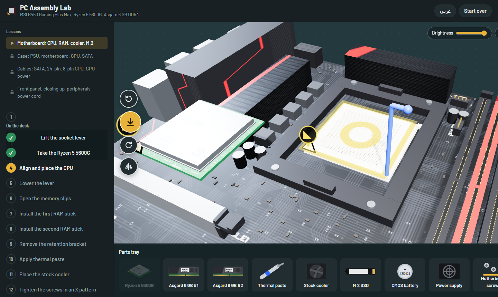
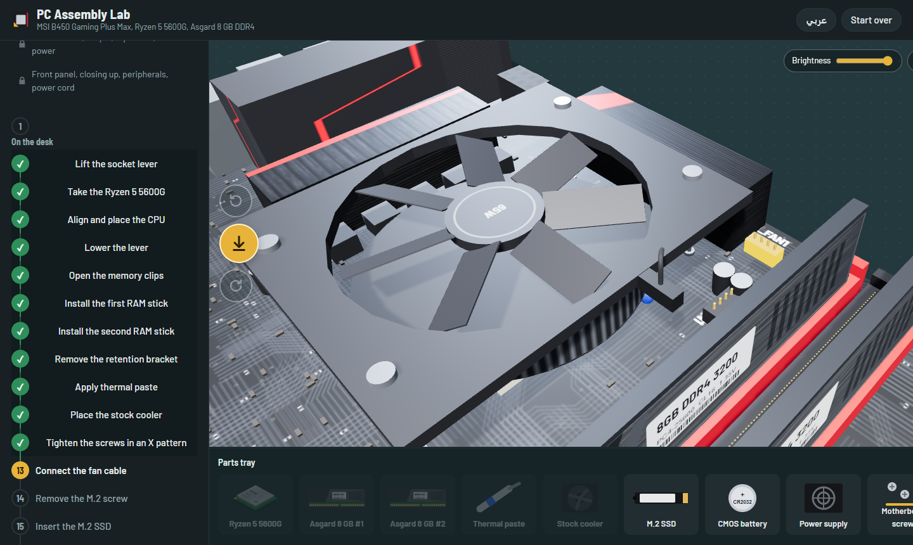
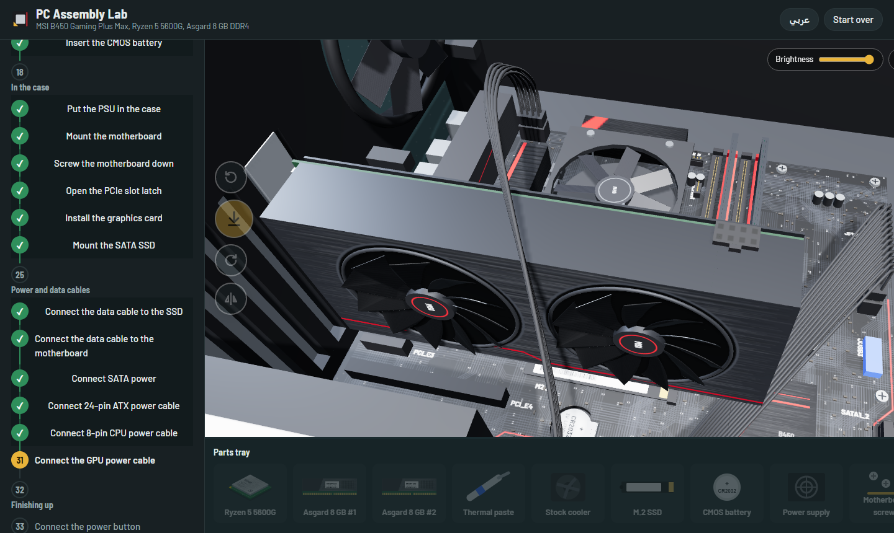
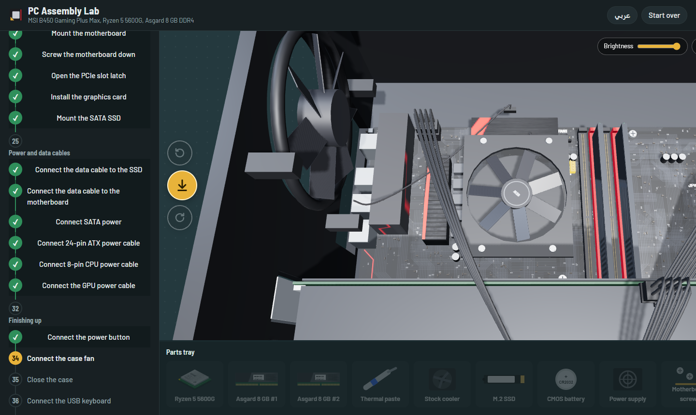
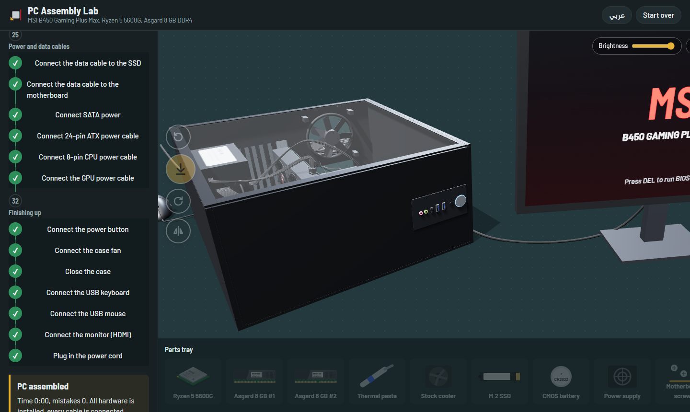

# PC Assembly Lab

An interactive 3D tutorial that walks you through building a real PC, one step at a time, in the browser.

**▶ Live demo: https://m-devops-dz.github.io/PC-Assembly-Lab/**

The build uses an **MSI B450 Gaming Plus Max** motherboard, an **AMD Ryzen 5 5600G** CPU and 2 × 8 GB DDR4. You pick up each part, turn it the right way and drop it into place. Mistakes are explained: a CPU turned the wrong way, RAM in the wrong slots, the cooler fan on the wrong header.



## What you build

35 steps in four lessons:

1. **Motherboard on the desk:** socket lever, CPU, RAM in the right dual-channel slots, thermal paste, stock cooler and screws in an X pattern, CPU fan cable, M.2 SSD, CMOS battery
2. **Into the case:** PSU, motherboard and standoff screws, PCIe latch, graphics card, SATA SSD
3. **Power and data cables:** SATA data and power, 24-pin ATX, 8-pin CPU, GPU power
4. **Finishing up:** front-panel power button, case fan, side panel, USB keyboard and mouse, HDMI to the graphics card, power cord

## Screenshots

| | |
|---|---|
|  |  |
| Stock cooler seated, fan cable going to CPU_FAN1 | GPU power cable |
|  |  |
| Rear case fan, going to SYS_FAN1 | Finished: case closed, peripherals plugged in, monitor on |

## Controls

| Action | Mouse / touch | Keyboard |
|---|---|---|
| Pick up a part | Click it in the parts tray | |
| Move a held part | Drag | |
| Rotate a held part | ⟲ / ⟳ buttons | `Q` / `E` |
| Flip a held part | Flip button | `F` |
| Place it | Drop button | `Space` |
| Orbit / zoom the camera | Drag empty space / scroll or pinch | |
| Skip the current step | | `Ctrl` + `H` |

With hints on, the next target glows. The interface is available in **English and Arabic** (with right-to-left layout).

## Run it locally

No build step and no install. Clone the repo and open `index.html` in a browser:

```sh
git clone https://github.com/m-devops-dz/PC-Assembly-Lab.git
cd PC-Assembly-Lab
# open index.html (double-click it, or serve the folder with any static server)
```

three.js r147 loads from a CDN, so the first load needs an internet connection.

## How it's built

- Plain HTML, CSS and JavaScript with [three.js](https://threejs.org/) r147. There's no framework and no bundler.
- Every part is modelled in code (`js/parts/`), with canvas-drawn textures for the board silkscreen, labels and key legends.
- The scripts are classic `<script>` tags that share one global scope, so the page also works when opened straight from `file://`.

```
index.html
css/style.css
js/core/    config, i18n (EN/AR text), helpers, layout, textures, scene and cameras
js/parts/   one file per 3D part: motherboard, CPU, RAM, cooler, case, PSU, GPU, cables, peripherals…
js/game/    step order and state, picking up parts, placement rules, connectors, input, UI, render loop
```

Steps are identified by name, not number (`STEP_IDS` in `js/game/state.js`), so a new step can go anywhere in the order. See [CLAUDE.md](CLAUDE.md) for the full contributor notes.
