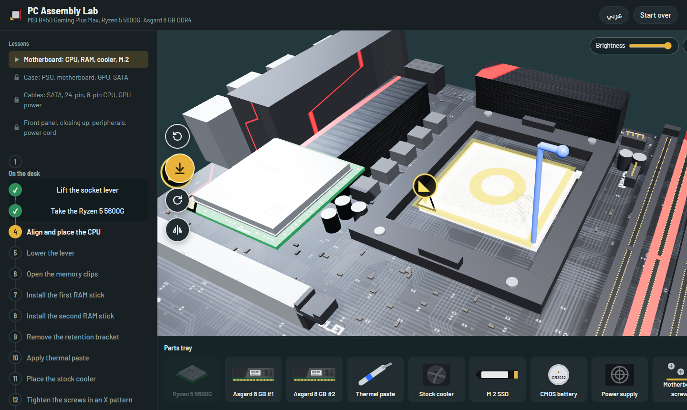
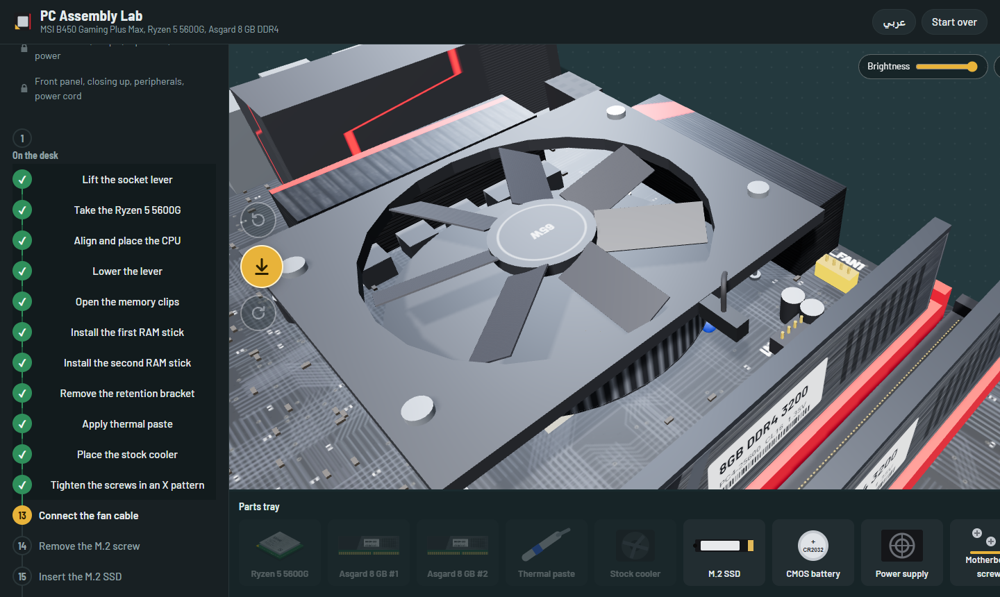
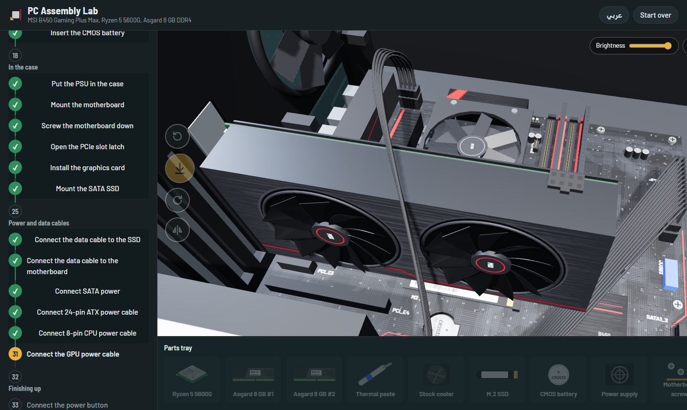
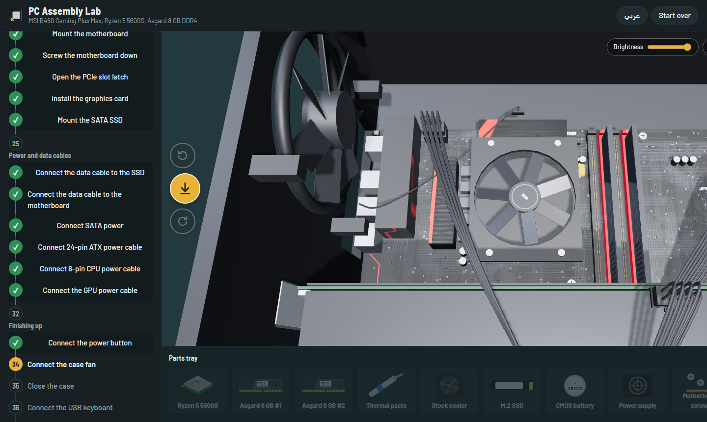
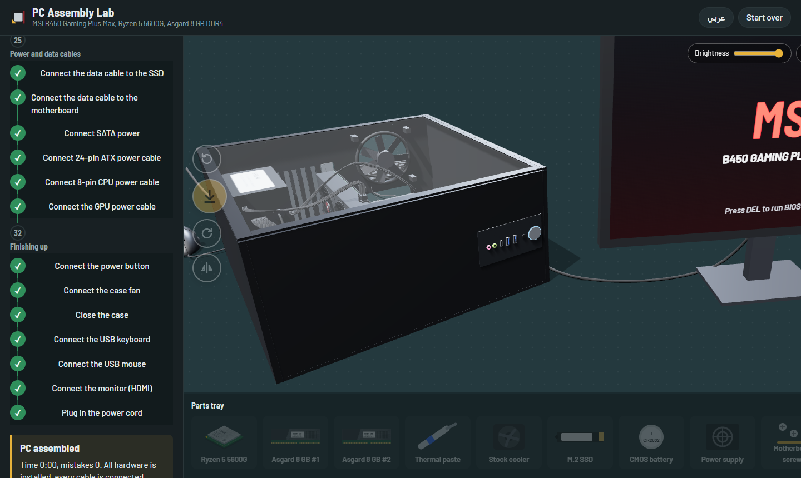

# PC Assembly Lab

An interactive 3D tutorial that walks you through building a real PC, one step at a time, in the browser.

**▶ Live demo: https://m-devops-dz.github.io/PC-Assembly-Lab/**

The build uses an **MSI B450 Gaming Plus Max** motherboard, an **AMD Ryzen 5 5600G** CPU and 2 × 8 GB DDR4. You pick up each part, turn it the right way and drop it into place. Mistakes are explained: a CPU turned the wrong way, RAM in the wrong slots, the cooler fan on the wrong header.



## What you build

39 steps in four lessons:

1. **Motherboard on the desk:** socket lever, CPU, RAM in the right dual-channel slots, thermal paste, stock cooler and screws in an X pattern, CPU fan cable, M.2 SSD, CMOS battery
2. **Into the case:** PSU, motherboard and standoff screws, PCIe latch, graphics card, SATA SSD
3. **Power and data cables:** SATA data and power, 24-pin ATX, 8-pin CPU, GPU power
4. **Finishing up:** front-panel power button, case fan, side panel, USB keyboard and mouse, HDMI to the graphics card, power cord

## Screenshots

| | |
|---|---|
|  |  |
| Stock cooler seated, fan cable going to CPU_FAN1 | GPU power cable |
|  |  |
| Rear case fan, going to SYS_FAN1 | Finished: case closed, peripherals plugged in, monitor on |

## Controls

| Action | Mouse / touch | Keyboard |
|---|---|---|
| Pick up a part | Click it in the parts tray | |
| Move a held part | Drag | |
| Rotate a held part | ⟲ / ⟳ buttons | `Q` / `E` |
| Flip a held part | Flip button | `F` |
| Place it | Drop button | `Space` |
| Orbit / zoom the camera | Drag empty space / scroll or pinch | |
| Skip the current step | | `Ctrl` + `H` |

With hints on, the next target glows. The interface is available in **English and Arabic** (with right-to-left layout).

## Modes

Switch modes from the menu in the header:

- **Build:** the 39 steps above.
- **Troubleshooting:** the PC starts fully built with one fault (no power, no display, a fan that doesn't spin, a missing drive, a wrong clock…). Press the power button, see the symptom, check the likely parts, fix the faulty one.
- **Windows install:** start the PC from the install stick and install Windows, plus challenges: make the stick on a laptop, a customer's PC with files to keep, partition plans, boot order in the BIOS (a PC with no boot menu key), a blue screen from faulty RAM, no Wi-Fi driver, Disk Management, and more.

## Classroom mode

For a computer room: the teacher's PC runs a small server and the students' PCs follow it over the local network. Nothing is installed on the students' PCs.

1. On the teacher's PC (needs [Python 3](https://www.python.org/downloads/)), double-click `classroom/start-class.bat`. The teacher's panel opens in the browser (`http://localhost:8080/teacher`). The first time, allow Python through the Windows firewall on private networks.
2. The window shows the address the students open, e.g. `http://192.168.1.10:8080`. If port 8080 is taken, the server uses the next free one.
3. Each student types their name. The teacher's panel then:
   - picks the mode for everyone, and the challenge or troubleshooting case
   - opens the build steps a few at a time (e.g. 1–10, then +10): students who finish wait for the teacher
   - moves everyone to a step, pauses the class, sends a message, allows or blocks skipping
   - shows each student's step, mistakes and time, and their PC's IP address
   - starts a **new session** (everyone types their name again, from step 1) or **resets** one student

The page only turns on classroom mode when the teacher's server serves it. The live site, `index.html` opened from a file and the offline zip all work as usual. A build survives a page reload in the classroom, and the students' pages reload themselves when the app on the teacher's PC is updated.

## Run it locally

No build step and no install. Clone the repo and open `index.html` in a browser:

```sh
git clone https://github.com/m-devops-dz/PC-Assembly-Lab.git
cd PC-Assembly-Lab
# open index.html (double-click it, or serve the folder with any static server)
```

three.js, JSZip and the fonts are in `vendor/`, so it works with no internet. The **Download offline** button in the header packs the whole app (and the classroom server) into a .zip.

## Tuning a camera view from the browser console

Each step's camera is an entry in `VIEWS` in [js/core/scene.js](js/core/scene.js): `pos` is where the camera sits, `tgt` is the point it looks at (both `[x, y, z]`). The scripts are classic, not modules, so `VIEWS`, `camera`, `controls`, `view` and `focus()` can all be used straight from the DevTools console (F12):

```js
view                                   // name of the current view, e.g. "cpu"

// 1. Orbit / zoom with the mouse until it looks right, then copy the values to the clipboard:
const r = v => +v.toFixed(1);
copy(`${view}:{pos:[${camera.position.toArray().map(r)}],tgt:[${controls.target.toArray().map(r)}]},`);
// copy() is a DevTools console helper (Chrome, Edge, Firefox); it doesn't exist in page scripts

// 2. Or set the numbers and fly there:
VIEWS.ram.pos = [6.8, 28, -2];
VIEWS.ram.tgt = [6.8, 0.5, -4.3];
focus("ram");                          // glides the camera to VIEWS.ram
```

Tune views in a desktop-size window: on phones (860px wide or less) every view is 1.5× farther from its target, so a copied line would be too far out. Changes made in the console are lost on reload. Paste the copied line into `VIEWS` in `scene.js` to keep it. Which view a step uses is decided by `viewFor()` in [js/game/state.js](js/game/state.js).

## How it's built

- Plain HTML, CSS and JavaScript with [three.js](https://threejs.org/) r147. There's no framework and no bundler.
- Every part is modelled in code (`js/parts/`), with canvas-drawn textures for the board silkscreen, labels and key legends.
- The scripts are classic `<script>` tags that share one global scope, so the page also works when opened straight from `file://`.

```
index.html
css/style.css
js/core/    config, i18n (EN/AR text), helpers, layout, textures, scene and cameras
js/parts/   one file per 3D part: motherboard, CPU, RAM, cooler, case, PSU, GPU, cables, peripherals…
js/game/    step order and state, picking up parts, placement rules, connectors, input, UI, troubleshooting, Windows install, classroom
js/screens/ the HTML screens: the PC's monitor (POST, BIOS, Windows Setup), the laptop's apps
classroom/  the classroom server (Python, standard library only) and the teacher's panel
```

Steps are identified by name, not number (`STEP_IDS` in `js/game/state.js`), so a new step can go anywhere in the order. See [CLAUDE.md](CLAUDE.md) for the full contributor notes.
